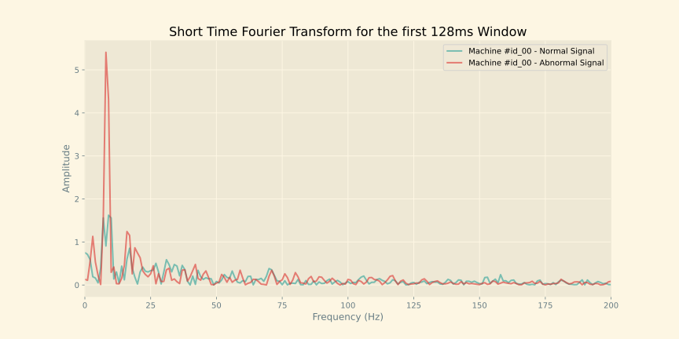
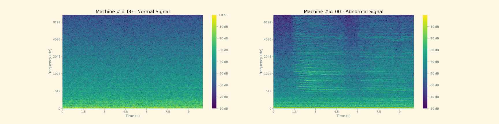
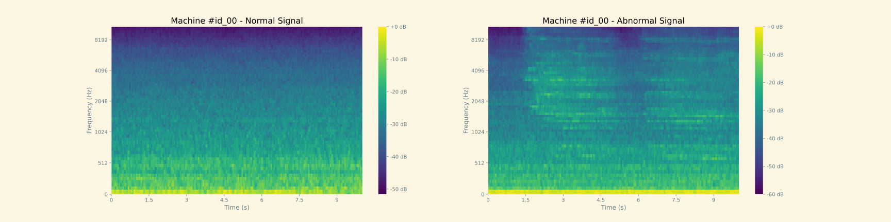
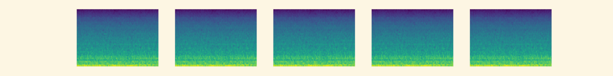
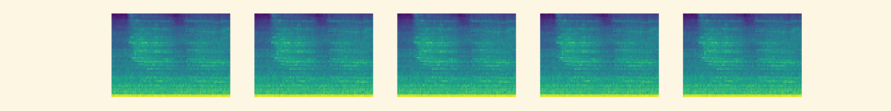
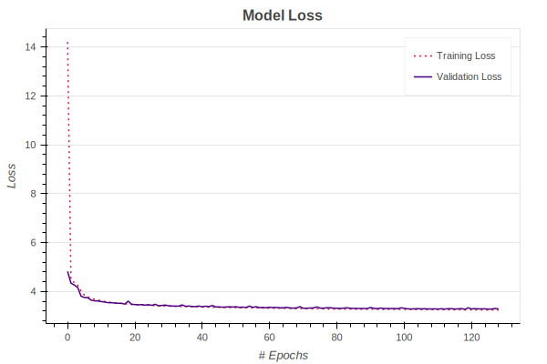
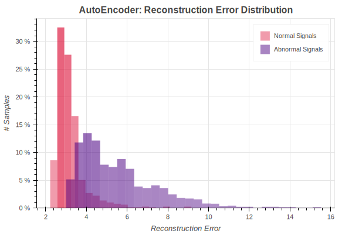

# 
### Goals

### Requirements

## Exploratory Data Analysis
### Wave Forms

### Short Time Fourier Transform

### Spectrograms (dB Scale)

### Mel-Spectrograms

### Multiple Frames of Spectrograms

