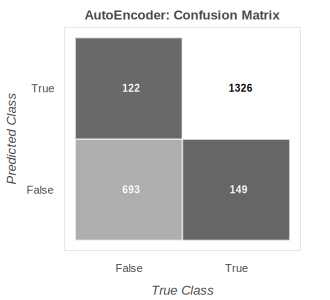
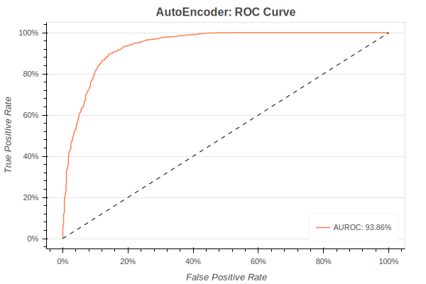

# 
### Goals

### Requirements

## Exploratory Data Analysis
### Wave Forms

### Short Time Fourier Transform

### Spectrograms (dB Scale)

### Mel-Spectrograms

### Multiple Frames of Spectrograms

    
  
  
  
  
  
  

### References
* [MIMII Dataset: Sound Dataset for Malfunctioning Industrial Machine Investigation and Inspection](https://zenodo.org/record/3384388#.YKiRwy-UEh8)
* [Harsh Purohit, Ryo Tanabe, Kenji Ichige, Takashi Endo, Yuki Nikaido, Kaori Suefusa, and Yohei Kawaguchi, “MIMII Dataset: Sound Dataset for Malfunctioning Industrial Machine Investigation and Inspection,” in Proc. 4th Workshop on Detection and Classification of Acoustic Scenes and Events (DCASE), 2019](https://arxiv.org/pdf/1909.09347.pdf)
* [MIMII Dataset Baseline](https://github.com/MIMII-hitachi/mimii_baseline) 
* [DCASE Challenge 2020: Unsupervised Detection of Anomalous Sounds for Machine Condition Monitoring](http://dcase.community/challenge2020/task-unsupervised-detection-of-anomalous-sounds)
* [Performing Anomaly Detection on Industrial Equipment Using Audio Signals](https://github.com/aws-samples/sound-anomaly-detection-for-manufacturing)